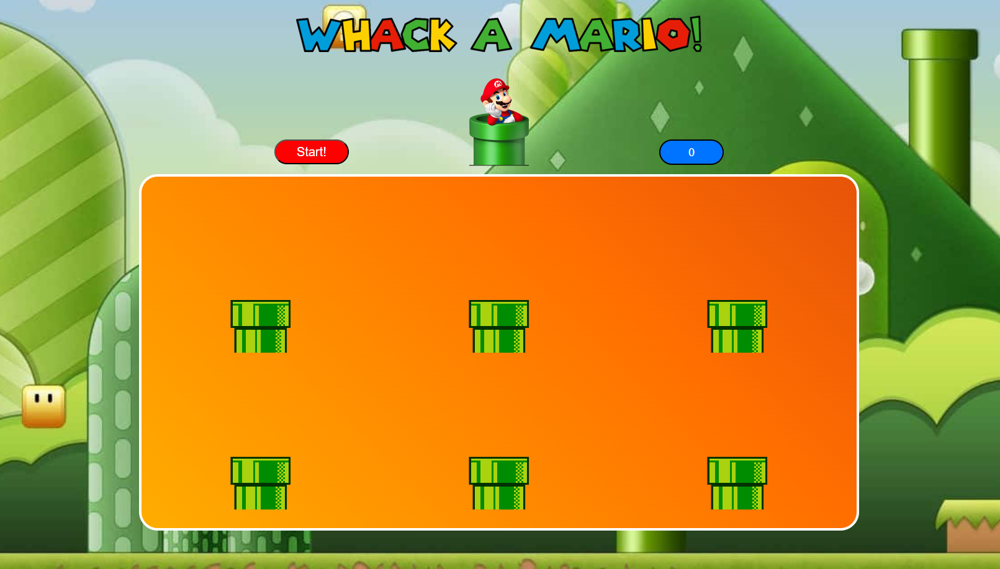

# Whack-a-Mario Game Project

This project is a game inspired by the concept of Whack-a-Mole, themed around the iconic characters from Super Mario Bros. It is created using HTML, CSS, and possibly JavaScript.

## Description

Whack-a-Mario aims to recreate the fun gameplay of Whack-a-Mole but with a Mario Bros twist. The game includes visual designs that incorporate elements from the Super Mario franchise.

## Features

- **Background**: Utilizes a themed background image or gradient with colors reminiscent of the Mario Bros world.
- **Visual Elements**: Includes designs and sprites inspired by the Mario Bros characters and settings.
- **Interactivity (optional)**: Plans to implement interactions using JavaScript to create the Whack-a-Mole gameplay.

## How to Use

1. Download or clone this repository.
2. Open the `index.html` file in your browser to play or view the Whack-a-Mario game.
3. Customize the code in the HTML, CSS, and index.js files according to your preferences.

## File Structure

- `index.html`: Contains the main structure of the Whack-a-Mario game.
- `styles.css`: CSS file defining visual styles for the game.
- `index.js` (optional): JavaScript file for interactions and game functionalities.

## Contributions

Contributions are welcome. Feel free to fork the project and send pull requests with improvements, bug fixes, or new features.

